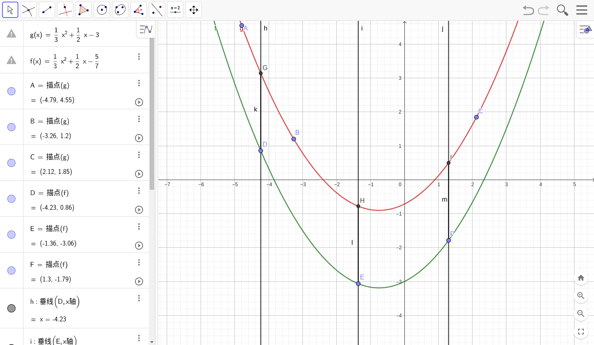

---
ebook:
  title: 北京邮电大学智能科学与技术2022级大二上第6周周赛题解
  base-font-size: 6
  margin: -2
---

# A. 单项选择

1. 选B。背，没啥好说的。考点：逻辑（离散数学-集合与逻辑）
2. 选C。浮点数是由尾数位和指数位组成的，两个浮点数如果指数位相差过大，那么在相加过程中，较小的一个数可能因为尾数位的精度不够而在对齐指数位的过程中变为0，从而导致结果错误。考点：基础知识（计算方法-引论）
3. 选A。链表不支持随机访问，所以只能从头开始遍历。考点：链表（数据结构-线性表）
4. 选D。以频率代替概率，根据题意，在高等数学挂科的情况下，人工智能导论挂科的概率是$1 \over 3$，通过的概率是$2 \over 3$，在高等数学通过的情况下，人工智能导论挂科的概率是$1 \over 7$，通过的概率是$6 \over 7$。依据条件熵的定义，$H(Y|X) = \sum_{i = 1}^n P(X = x_i)H(Y|X = x_i)$，所以$H(Y|X) = {3 \over 10} \cdot (-{1 \over 3}log_2{1 \over 3} - {2 \over 3}log_2{2 \over 3}) + {7 \over 10} \cdot (-{1 \over 7}log_2{1 \over 7} - {6 \over 7}log_2{6 \over 7}) = 0.6897$。考点：决策树（人工智能导论-机器学习基础）
5. 选C。A、B、D都很容易构建一个有限状态自动机，排除法选C。

> 有的人可能疑惑A为什么可以被DFA表示，下面给出一种构造，这种自动机有$\{s, e, q_0, q_1, q_2, q_3, q_4, q_5, q_6, t\}$九个状态，其中初始态为$s$，接受态为$\{q_0\}$，状态转移函数定义为
$$
\delta(q_n, w) = \begin{cases}
q_{(10n + w) \mod 7}, w\text{是一个十进制数字} \\
t, w = -
\end{cases} \\
\delta(e, w) = \begin{cases}
q_{w \mod 7}, w\text{是一个十进制数字} \\
t, w = -
\end{cases} \\
\delta(s, w) = \begin{cases}
q_{w \mod 7}, w\text{是一个十进制数字} \\
e, w = -
\end{cases} \\
\delta(t, w) = t
$$

下面说说为啥C不行。假设一个有限状态自动机，长度为质数的十进制数，根据泵引理，一个长于自动机状态数的字符串必然可以被分为长度为$p$、$q$、$r$的三段，其中$p + q + r = n$，且$q > 0$，使得对于任意正整数$k$，长度$p + kq + r$的字符串也在自动机中。若$p + r$等于$0$，那么令$k = 2$，$2q$是合数，若$p + r$等于$1$，令$k = 0$，$1$不是质数，那么令$k = p + r$，$(q + 1)(p + r)$是合数，矛盾，故C不行。考点：泵引理（形式语言与自动机-有限状态自动机）

**标准程序：**
```python
print('BCADC')
```

# B. 集合比较

考点：集合（离散数学-集合与逻辑）

签到题，本题要求输入两个集合，并比较这两个集合。

本题被削了，$O(n^2)$也能过。

所以最简单的做法是遍历$X$中的元素，判断是否在$Y$中，然后再遍历$Y$中的元素，判断是否在$X$中。如果使用标准库中的二分查找或者基于平衡二叉树的集合，这样的时间复杂度是$O(nlogn)$，可通过本题，随题解发送的Python版的标准程序就是这样写的。

但是，本题提供的集合是按单调递增顺序存储的，所以可以用双指针的方法，将时间复杂度降低到$O(n)$，这是随题解发送的资料包中C版的标准程序的做法。这种做法类似归并排序，使用两个指针分别从$X$、$Y$开始向后扫描，如果相等，则两个指针都向后移动一位，若$X$的指针指向的元素小于$Y$的指针指向的元素，由于$Y$严格递增，不可能在$Y$的后面找到这个数，因此可以判断$Y$不包含$X$，然后将$X$的指针后移，继续比较。上述操作对$X$、$Y$反过来也一样。如果有一个集合先枚举完成，则这个集合肯定不包含另一个集合。

下面程序中，`next()`的第二个参数是指针枚举到底时返回的值。

**标准程序：**
```python
x = list(map(int, input().split()))[1:]
y = list(map(int, input().split()))[1:]
x_contains_y, y_contains_x = True, True
x_iter, y_iter = iter(x), iter(y)
x_val, y_val = next(x_iter, None), next(y_iter, None)
while x_val is not None or y_val is not None:
    if x_val is None:
        x_contains_y = False
        break
    elif y_val is None:
        y_contains_x = False
        break
    elif x_val < y_val:
        y_contains_x = False
        x_val = next(x_iter, None)
    elif x_val > y_val:
        x_contains_y = False
        y_val = next(y_iter, None)
    else:
        x_val = next(x_iter, None)
        y_val = next(y_iter, None)
if x_contains_y and y_contains_x:
    print('=')
elif x_contains_y:
    print('>')
elif y_contains_x:
    print('<')
else:
    print('.')
```

# C. 埃及分数

考点：构造（离散数学-证明）

本题要求对于给定的一个埃及分数，构造另一个埃及分数，使得这两个序列表示同一个分数。（以此来证明所有分数都没有唯一的埃及分数表示）

注意到：
$$
\frac{1}{n} = \frac{1}{n+1} + \frac{1}{n(n+1)}
$$

于是我们将最后一项裂开，就可以构造出一个新的埃及分数。

**标准程序：**
```python
input()
v = list(map(int, input().split()))
print(len(v) + 1)
print(*v[:-1], v[-1] + 1, v[-1] * (v[-1] + 1))
```

# D. 多项式族

考点：插值（计算方法-插值与拟合）

本题有两个不超过$n$次的多项式$f$、$g$，并给出了各自上面的$n + 1$个点，询问$f(x) - g(x)$是否是常数，如果是，输出常数值。

考虑到$n + 1$个点能唯一确定一个$n$次多项式，我们可以插值求出$f(x_{g, 1}), f(x_{g, 2}), ..., f(x_{g, n + 1})$，然后判断$f(x) - g(x)$是否是常数。至于你用拉格朗日插值还是牛顿插值，本题精度要求不高，随便选一个都可以。

这样说可能比较抽象，去Geogebra上画一下图就知道了。



**标准程序：**
```python
def lagrange(known, x):
    sum = 0
    for i in range(len(known)):
        product = known[i][1]
        for j in range(len(known)):
            if i != j:
                product *= (x - known[j][0]) / (known[i][0] - known[j][0])
        sum += product
    return sum

n = int(input())
f = [list(map(int, input().split())) for _ in range(n + 1)]
g = [list(map(int, input().split())) for _ in range(n + 1)]

c = f[0][1] - lagrange(g, f[0][0])
for i in range(1, n + 1):
    if abs(lagrange(g, f[i][0]) + c - f[i][1]) > 1e-6:
        print('NO')
        exit()
print('YES')
print(c)
```