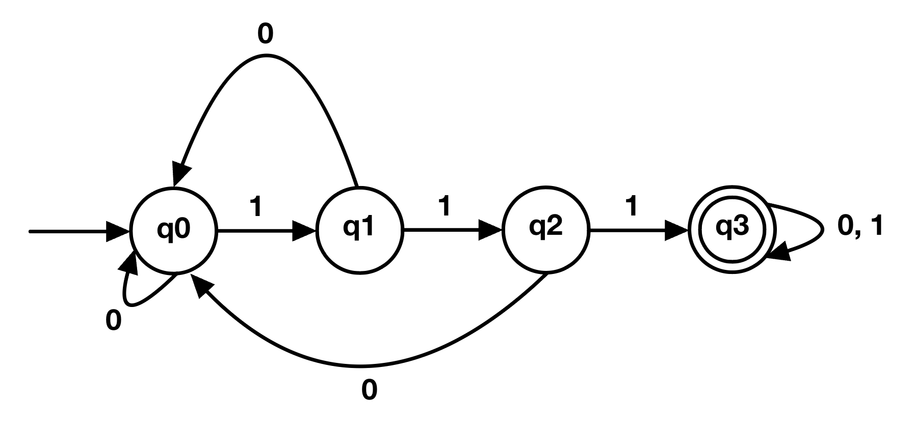
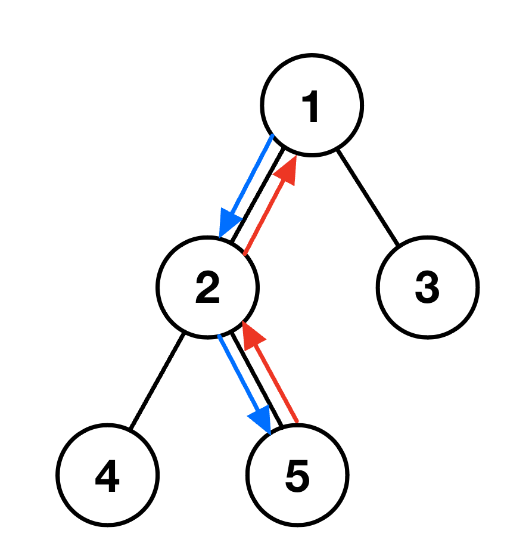

---
ebook:
  title: 北京邮电大学智能科学与技术2022级大二上第9周周赛题目
  base-font-size: 6
  margin: -2
---

# <center>A. 小Y的多项式</center>
<center>1 seconds, 128 megabytes</center>

<br/><br/>

小Y有一个 $n$ 次多项式 $a_0 + a_1x + \dots + a_nx^n$，其中，$x^i$ 项的系数为 $a_i$ 。

对其求二阶导数，可以得到一个 $n-2$ 次多项式 $b_0 + b_1x + \dots + b_{n-2}x^{n-2}$，其中，$x^i$ 的系数为 $b_i$。

小Y想让你帮忙求出这个 $n-2$ 次多项式的系数。即，给定 $a_0, a_1, \cdots, a_n$，求出 $b_0, b_1, \cdots, b_{n-2}$ 的值。

### Input

第一行，一个整数 $n$  $(2 \leq n \leq 10^5)$。

第二行，$n+1$ 个整数 $a_0, a_1, \cdots, a_n$ $(1 \leq a_i \leq 10^3)$。

### Output

一行，$n-1$ 个整数 $b_0, b_1, \cdots, b_{n-2}$。

### Example
#### Input
```
5
1 2 3 4 5 6
```
#### Output
```
6 24 60 120
```

### Note
样例解释：

$$f(x) = 1 + 2x + 3x^2 + 4x^3 + 5x^4 + 6x^5$$

$$f'(x) = 2 + 6x + 12x^2 + 20x^3 + 30x^4$$

$$f''(x) = 6 + 24x + 60x^2 + 120x^3$$

<div style="page-break-after: always"></div>

# <center>B. 小Y的自动机</center>
<center>1 seconds, 128 megabytes</center>

<br/><br/>

**本题无需《形式语言及自动机》课程的前置知识。**

小Y构造了一个如图所示的有限状态自动机。它接受所有含有至少连续 $3$ 个 $1$ 的 $01$ 串（即只包含字符 $0$ 和 $1$ 的字符串）。

现在小Y想要对这个自动机进行拓展。使它能够对于给定的 $n$，接受所有含有至少 $n$ 个 $1$ 的 $01$ 串。
例如，$n=5$ 时，$11111101$ 可以被接受，因为它包含至少连续的 $5$ 个 $1$；而 $111101111$ 不能被接受，因为它只含有至多连续的 $4$ 个 $1$。
小Y现在有 $m$ 个 $01$ 串，TA 想要让你帮忙判断这些 $01$ 串是否能被该自动机接受。对于每一个 $01$ 串，如果它可以被接受，输出`YES`，否则输出`NO`。


### Input

第一行，两个整数 $n, m$ $(0 \leq n \leq 10^6$, $1 \leq m \leq 10^3)$。

接下来的 $m$ 行，每行一个 $01$ 串 $S$ $(1 \leq |S| \leq 10^6)$。

保证 $\sum|S| \leq 10^6$。

### Output

$m$ 行，每行一个字符串 `Yes` 或 `No` (需要区分大小写）。

### Examples
#### Input #1

```
5 3
11000001
111101111011111
111111111111111
```

#### Output #1

```
No
Yes
Yes
```

### Note

<div style="page-break-after: always"></div>

# <center>C. 小Y的猫猫</center>
<center>1 seconds, 128 megabytes</center>

<br/><br/>

小Y的家里养了一只十分可爱的猫猫。有一天，小Y发现猫猫被困在了院子里的一棵树上！你能帮助TA把猫猫救下来吗？

通过观察，你发现这是一棵有 $n$ 个节点的“有根二叉树”（即确定树根，且每个节点最多只有两个孩子）。将这 $n$ 个节点分别编号为 $1, 2, \cdots, n$。其中，根节点编号为 $1$，猫猫所处的节点编号为 $k$。

请你帮忙规划营救猫猫的路线，即确定小Y从根节点出发，到达猫猫所处节点然后返回根节点依次经过的节点编号。我们知道，树上任意两个节点之间（不经过重复节点）的路径是唯一的，因此答案一定唯一。

### Input
第一行，两个整数 $n, k$ $(1 \leq n \leq 10^5, 1 \leq k \leq n)$。

接下来的 $n$ 行，每行两个整数。第 $i$ 行的整数记为 $l_i, r_i$ $(0 \leq l_i, r_i \leq n)$，表示 $i$ 号节点左右孩子的编号。$l_i=0$ 表示该节点的左孩子为空，$r_i=0$ 表示该节点的右孩子为空。

保证输入为一棵合法的树。

### Output

一行，若干个整数，表示小Y从根节点出发，到达猫猫所处节点然后返回根节点依次经过的节点编号。

### Example
#### Input #1

```
5 5
2 3
4 5
0 0
0 0
0 0
```

#### Output #1

```
1 2 5 2 1
```

#### Input #2

```
1 1
0 0
```

#### Output #2

```
1
```

### Note

样例1解释：

如图所示，小Y营救猫猫的路线为 $1 \rightarrow 2 \rightarrow 5 \rightarrow 2 \rightarrow 1$。

样例2解释：

由于猫猫位于根节点，小Y不需要任何移动，路线为 $1$。

<div style="page-break-after: always"></div>

# <center>D. 小Y的组合数学</center>
<center>1 seconds, 128 megabytes</center>

<br/><br/>

组合数学是最让小Y最痛苦的一门学科！

正所谓有福同享，有难同当，小Y也想将这份痛苦和别人一起分享。于是，TA 出了这道题来考考你：

有一初始为 $x$ 的变量，每次操作可以选择将其自增 $1$ 或自减 $1$（但不能减为负值）。求进行 $k$ 次操作后，变量恰好等于 $0$ 的不同操作方法数。

记某种操作方法为 $[a_1, a_2, \cdots, a_t]$ ，其中，$a_i$ 表示第 $i$ 次的操作（自增 $1$ 或自减 $1$）。

$[a_1, a_2, \cdots, a_t]$ 和 $[a_1', a_2', \cdots, a_t']$ 两种操作方法不同，当且仅当 $\exist\ i \in [1, t], a_i \neq a_i'$。

### Input

一行，两个整数 $x, k$ $(0 \leq x \leq 10^6, 1 \leq k \leq 10^6)$。

### Output

一行，一个整数，表示进行 $k$ 次操作后，变量恰好等于 $0$ 的不同操作方法数。

由于答案可能很大，你只需要回答对 $998244353$ 取模后的结果即可。

### Examples

#### Input #1

```
0 4
```

#### Output #1

```
2
```

#### Input #2

```
10 7
```

#### Output #2

```
0
```

#### Input #3

```
114 514
```

#### Output #3

```
338901372
```

### Note

样例 1 解释：

$2$ 种操作方法分别为：

$[$自增 $1, $自减 $1, $自增 $1, $自减 $1]$

$[$自增 $1, $自增 $1, $自减 $1, $自减 $1]$

样例 2 解释：

可以证明，通过 $7$ 次操作一定无法使变量等于 $0$。


提示：
考虑一个质数 $P$ ，如果两个整数 $x$、$y$ 满足 $x \mod P = y \mod P$，那么就称 $x$、$y$ 在模 $P$ 意义下等价，记作 $x \equiv y \pmod P$。比如，$17 \equiv 3 \pmod 7$、$-1 \equiv 6 \pmod 7$。

可以证明，在模 $P$ 意义下，对于任意一个 $x \in [1, P - 1]$，都存在唯一一个 $y \in [1, P - 1]$，使得 $xy \equiv 1 \pmod{P}$。这个 $y$ 就是 $x$ 的逆元，记作 $x^{-1}$ 或者 $\dfrac{1}{x}$。比如，$2 \times 3 \equiv 6 \equiv 1 \pmod 5$，所以$\dfrac{1}{2} \equiv 3 \pmod 5$。

若正整数 $x, k \in [1, P - 1] $，显然有 $P + kx \equiv kx \pmod P$，等式两边同时乘以 $\dfrac{1}{x(P + kx)}$ 得 $\dfrac{1}{x} \equiv \dfrac{k}{P + kx} \pmod P$，$x > 1$ 时取 $k = -\lfloor \dfrac{P}{x}  \rfloor$，得递推式 $\dfrac{1}{x} \equiv -\lfloor \dfrac{P}{x}\rfloor\dfrac{1}{P \mod x} \pmod P$。

可以直接使用以下程序实现求逆元以及模意义下的除法运算：

```c
const int P = 998244353;

int inv(int x) {
	if (x == 1) return 1;
	return 1LL * (P - P / x) * inv(P % x) % P;
}

int divide(int a, int b) {
    return 1LL * a * inv(b) % P;
}

int main() {
    int c = divide(5, 3); // 在模P的意义下等价于 c = 5 / 3，注意并不是向下取整
    // do something ...
    return 0;
}
```

<div style="page-break-after: always"></div>

# <center>E. 小Y的糖果</center>
<center>3~5 seconds, 512 megabytes</center>

<br/><br/>

小Y共有 $m$ 个收纳盒，编号分别为 $1, 2, \cdots, m$。每个收纳盒的最大容量均为 $k$。TA 准备将自己在万圣节收到的 $n$ 颗糖果装到这些收纳盒里，请你帮忙计算一下共有多少种装糖果的方法。

记某种装糖果的方法为 $[a_1, a_2, \cdots, a_m]$ ，其中，$a_i$ 表示编号为 $i$ 的盒子装有 $a_i$ 颗糖果。

$[a_1, a_2, \cdots, a_m]$ 和 $[a_1', a_2', \cdots, a_m']$ 两种装糖果的方法不同，当且仅当 $\exist\ i \in [1, m], a_i \neq a_i'$。

### Input

一行，三个整数 $n, m, k$ $(1 \leq n,m,k \leq 10^6)$。

### Output

一行，一个整数，表示装糖果的方法数。

由于答案可能很大，你只需要回答对 $998244353$ 取模后的结果即可。

### Examples

#### Input #1

```
2 3 1
```

#### Output #1

```
3
```

#### Input #2

```
2 5 1
```

#### Output #2

```
10
```

#### Input #2

```
114 514 19
```

#### Output #2

```
597569216
```

### Note

样例 1 解释：

将 $2$ 颗糖果装入 $3$ 个盒子，并且每个盒子中最多装 $1$ 颗糖果，有以下三种装法：

$[1, 1, 0]$

$[0, 1, 1]$

$[1, 0, 1]$


提示：
考虑一个质数 $P$ ，如果两个整数 $x$、$y$ 满足 $x \mod P = y \mod P$，那么就称 $x$、$y$ 在模 $P$ 意义下等价，记作 $x \equiv y \pmod P$。比如，$17 \equiv 3 \pmod 7$、$-1 \equiv 6 \pmod 7$。

可以证明，在模 $P$ 意义下，对于任意一个 $x \in [1, P - 1]$，都存在唯一一个 $y \in [1, P - 1]$，使得 $xy \equiv 1 \pmod{P}$。这个 $y$ 就是 $x$ 的逆元，记作 $x^{-1}$ 或者 $\dfrac{1}{x}$。比如，$2 \times 3 \equiv 6 \equiv 1 \pmod 5$，所以$\dfrac{1}{2} \equiv 3 \pmod 5$。

若正整数 $x, k \in [1, P - 1] $，显然有 $P + kx \equiv kx \pmod P$，等式两边同时乘以 $\dfrac{1}{x(P + kx)}$ 得 $\dfrac{1}{x} \equiv \dfrac{k}{P + kx} \pmod P$，$x > 1$ 时取 $k = -\lfloor \dfrac{P}{x}  \rfloor$，得递推式 $\dfrac{1}{x} \equiv -\lfloor \dfrac{P}{x}\rfloor\dfrac{1}{P \mod x} \pmod P$。

可以直接使用以下程序实现求前 $n$ 个数的逆元$1^{-1}, 2^{-1}, \cdots, n^{-1} \pmod P$，以及模意义下的除法运算：

```c
#define MAXN 2000001
const int P = 998244353;

int INV[MAXN];

void init_inv(int n) {
    INV[1] = 1;
    for (int i = 2; i <= n; i++) {
        INV[i] = 1LL * (P - P / i) * INV[P % i] % P;
    }
}

int divide(int a, int b) {
    return 1LL * a * INV[b] % P;
}

int main() {
    init_inv(2000000);
    int c = divide(5, 3); // 等价于 c = 5 / 3，注意并不是向下取整
    // do something ...
    return 0;
}
```